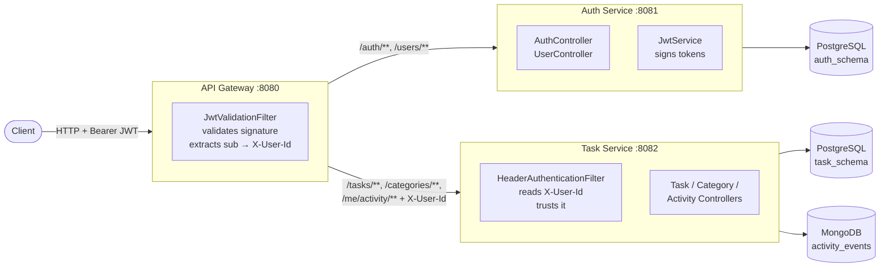

# Task Manager Microservices

[](https://github.com/Toleflaco/task-manager-microservices/actions/workflows/ci.yml)

**Java 21 · Spring Boot 3.5 · Spring Cloud Gateway · PostgreSQL · MongoDB · JWT · Testcontainers**

Decomposition of [`task-manager-api`](https://github.com/Toleflaco/task-manager-api)
into a microservices architecture with an API Gateway and two backing
services. It is the continuation of my self-taught Java backend learning
roadmap, focused on distributed system patterns: bounded-context
decomposition, border authentication with JWT validation at the edge,
and header-propagated identity to downstream services that no longer
validate tokens themselves.

The system is composed of three independently deployable Spring Boot
services communicating over HTTP. The **API Gateway** (Spring Cloud
Gateway on Netty) is the only entry point exposed to clients: it
validates JWTs signed by the auth service, extracts the user id from
the `sub` claim, and propagates it as an `X-User-Id` header to
downstream services. The **auth service** owns user registration,
login, refresh-token rotation, and JWT issuance. The **task service**
owns tasks, categories, and the activity audit log — it trusts the
`X-User-Id` header injected by the gateway and never validates JWTs
itself. This is the *border authentication* pattern: authentication
happens once, at the edge, and internal services confine themselves to
their business responsibility.

Each service is built as a Maven module under a single reactor parent,
with its own database schema, its own Flyway migrations, and its own
Testcontainers setup for local development. This project is in active
development as Phase 10 of the roadmap.

## Tech stack

- **Java 21** — modern language features (records, pattern matching, virtual threads support).
- **Spring Boot 3.5.4** — application framework across the three services (downgraded from monolith's Spring Boot 4.x for Spring Cloud 2025.0.0 compatibility).
- **Spring Cloud Gateway 2025.0.0 (Northfields)** — reactive gateway on Netty, declarative routing, `GlobalFilter` for JWT validation.
- **Spring Security 6** — servlet-stack security in the task service, custom `OncePerRequestFilter` for header-based authentication.
- **Spring Data JPA + Hibernate 6** — ORM in both services, JPA Specifications, entity graphs, optimistic locking with `@Version`.
- **Spring Data MongoDB** — activity audit log in the task service.
- **PostgreSQL 14** — one database instance with schema-per-service (`auth_schema`, `task_schema`).
- **Flyway** — versioned schema migrations per service, `ddl-auto: validate` in every environment.
- **jjwt 0.12.6** — JWT signing (HMAC-SHA256) in the auth service and verification in the gateway.
- **BCrypt** — password hashing.
- **Bucket4j 8.10.1** — token-bucket rate limiting on the auth service's `/auth/login`.
- **Testcontainers 2.0.5** — PostgreSQL 14 and MongoDB 6.0 containers with `@ServiceConnection` for local development and integration testing. Container reuse enabled to keep dev iterations fast.
- **JUnit 5 + Mockito + AssertJ** — unit tests carried over from the monolith with BDDMockito style.
- **Maven multi-module** — single reactor `pom.xml` with three sub-modules (`api-gateway`, `auth-service`, `task-service`), shared `<dependencyManagement>` for Spring Cloud BOM, Testcontainers BOM, jjwt, and MapStruct.
- **MapStruct 1.6.3** — compile-time DTO ↔ entity mapping with `ReportingPolicy.ERROR` for fail-fast on field changes.
- **SLF4J + Logback** — structured logging.
- **Spring Boot Actuator** — health endpoints in all three services (`/actuator/health`), plus `/actuator/gateway/routes` on the gateway for route introspection.
- **Jakarta Validation** — request body validation via annotations.

## Architecture

Three services, one entry point, border authentication:



The full rationale for placing JWT validation at the gateway (and not
at each service), the trust boundary implied by header propagation,
and the alternatives considered are documented in
[`docs/adr-004-border-authentication.md`](docs/adr-004-border-authentication.md).

**Trust boundary.** The gateway is the only service exposed to clients.
In production, the auth service and task service live on an internal
network (Docker Compose network today, VPC subnets in a cloud
deployment tomorrow) and are not directly reachable. This makes the
downstream trust in `X-User-Id` a valid architectural choice, not a
security gap: any request that reaches the task service has, by
construction, already been authenticated at the border.

**Bounded contexts.** The service split follows the domain boundary
made explicit during the monolith work: identity concerns
(registration, credentials, tokens) live in the auth service; task
management concerns (tasks, categories, activity log) live in the task
service. Cross-service foreign keys do not exist at the database
level — each service stores foreign identifiers as regular `BIGINT`
columns, with referential integrity enforced at the application layer
through the propagated user id.

**Polyglot persistence in the task service.** PostgreSQL for
transactional data (tasks, categories) and MongoDB for the append-only
activity audit log — the same rationale documented in the monolith's
[ADR-001](https://github.com/Toleflaco/task-manager-api/blob/main/docs/adr-001-polyglot-persistence.md).

## Getting started

Each service can be run independently against Testcontainers-managed
infrastructure using the Spring Boot `test-run` goal. This starts the
service against a fresh PostgreSQL (and MongoDB for the task service)
container, applying Flyway migrations at startup, without requiring
any database installed on the host.

### Requirements

- Docker Desktop (or Docker Engine on Linux) — Testcontainers spins
  up PostgreSQL 14 and MongoDB 6.0 containers on demand.
- Java 21 (Temurin recommended). The Maven wrapper handles the rest.

### Run the three services

Three terminals, one per service, from the repository root:

```bash
# Terminal 1 — auth-service on port 8081
./mvnw -pl auth-service spring-boot:test-run

# Terminal 2 — task-service on port 8082
./mvnw -pl task-service spring-boot:test-run

# Terminal 3 — api-gateway on port 8080
./mvnw -pl api-gateway spring-boot:run
```

The gateway does not require Testcontainers (it has no database of
its own), so it uses the plain `spring-boot:run` goal. The auth and
task services use `spring-boot:test-run`, which activates the
`TestcontainersConfig` under `src/test/java` and wires the datasource
via `@ServiceConnection`. Container reuse is enabled, so subsequent
restarts pick up the already-running containers and start in seconds.

### End-to-end flow

Once the three services are up, a full flow through the gateway looks
like this:

```bash
# 1. Register a user (public, no JWT required)
curl -X POST http://localhost:8080/users \
  -H "Content-Type: application/json" \
  -d '{"name":"Alice","email":"alice@example.com","password":"Password123!"}'

# 2. Log in and receive tokens (public)
curl -X POST http://localhost:8080/auth/login \
  -H "Content-Type: application/json" \
  -d '{"email":"alice@example.com","password":"Password123!"}'
# → { "accessToken": "eyJhbGciOi...", "refreshToken": "...", "expiresIn": 900 }

# 3. Create a category with the access token
curl -X POST http://localhost:8080/categories \
  -H "Authorization: Bearer <accessToken>" \
  -H "Content-Type: application/json" \
  -d '{"name":"Work","description":"Work-related tasks"}'
```

The gateway validates the JWT, extracts the subject as user id, and
propagates it as `X-User-Id` to the task service, which uses it for
authorization and to populate `createdBy` on the entity through JPA
auditing.

### Health endpoints

All three services expose Spring Boot Actuator's health endpoint:

```bash
curl http://localhost:8080/actuator/health   # gateway
curl http://localhost:8081/actuator/health   # auth-service
curl http://localhost:8082/actuator/health   # task-service
```

The gateway additionally exposes `/actuator/gateway/routes` in
read-only mode for route introspection.

## Repository layout

```
task-manager-microservices/
├── api-gateway/          # Spring Cloud Gateway, JWT validation, routing
├── auth-service/         # Users, credentials, tokens
├── task-service/         # Tasks, categories, activity log
├── docs/                 # Architecture Decision Records (ADRs)
└── pom.xml               # Parent reactor with shared dependency management
```

## Related work

- [`task-manager-api`](https://github.com/Toleflaco/task-manager-api) —
  the monolith this project derives from. All decisions on domain
  modelling, persistence patterns, security implementation and testing
  strategy were made and documented there first. This repository
  applies those decisions to a distributed context and adds the ones
  specific to it.

## Roadmap

This project is in active development. Currently in place: three-service
decomposition, gateway with JWT validation, border authentication with
`X-User-Id` propagation, per-service Testcontainers setup, and
migration of persistence from the monolith. Planned next: ADR-004
documenting the security architecture, containerization with Docker
Compose, and additional resilience and observability patterns.
