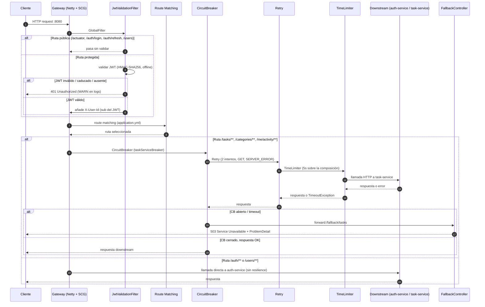

# Flujo del API Gateway

## Diagrama (Mermaid)

## Notas del flujo

🔹 Stack y punto de entrada
- Netty como servidor (reactive event loop).
- Puerto expuesto: 8080 (único puerto del sistema publicado al host).
- Modelo no bloqueante: todo es `Mono<Void>` y `chain.filter(exchange)`.
- Se ve en los logs por el prefijo del thread: `or-http-epoll-N` (gateway) vs `nio-8081-exec-N` (auth-service, servlet stack).

🔹 JwtValidationFilter (GlobalFilter custom)
- Único punto de autenticación del sistema.
- Rutas públicas (`/actuator`, `/auth/login`, `/auth/refresh`, `/users`) pasan sin validar.
- Rutas protegidas:
    - Sin `Authorization: Bearer ...` → 401 inmediato, la petición nunca cruza al downstream.
    - JWT malformado, con firma inválida o caducado → `JwtException` capturada, WARN en logs, 401 inmediato.
    - JWT válido → extrae `sub` como `userId`, muta el request con `X-User-Id`, sigue.
- Define el trust boundary: downstream confía en la cabecera porque solo el gateway la emite.
- Verificación offline (HMAC-SHA256 con clave compartida vía `${JWT_SECRET}`). Sin llamada a auth-service.

🔹 Route Matching (`application.yml`)
Tres rutas configuradas:
- `auth-service-route`: `/auth/**` → `${services.auth-uri}` (auth-service:8081).
- `auth-users-route`: `/users/**` → `${services.auth-uri}` (auth-service:8081).
- `task-service-route`: `/tasks/**`, `/categories/**`, `/me/activity/**` → `${services.task-uri}` (task-service:8082).

Toda la lógica de matching y filtros vive en YAML, no en Java. Externalización deliberada.

🔹 Resilience para rutas del task-service
Orden real (outer → inner):
1. **CircuitBreaker** (`taskServiceBreaker`): sliding window COUNT_BASED de 10, mínimo 5 llamadas, umbral 50% de fallo, 10s en OPEN, 3 llamadas de prueba en HALF_OPEN.
2. **Retry**: 2 intentos, solo GET, solo `SERVER_ERROR` (5xx). Backoff exponencial con factor 2, `firstBackoff` 500ms, `maxBackoff` 1500ms, `basedOnPreviousValue: false`.
3. **TimeLimiter** (5s): sobre la composición completa, NO por intento. `cancelRunningFuture: true` cancela el future subyacente al disparar.
4. Llamada HTTP downstream.

Motivación (verificada empíricamente en K01-B):
- CB fuera → protege al gateway y a la ventana estadística de amplificación por reintentos.
- Retry dentro → un éxito tras reintento registra como SUCCESS único ante el CB.
- TimeLimiter → convierte colgados en `TimeoutException`, contabilizados como fallo por el CB.

🔸 Sobre los timeouts declarados en metadata
- El YAML declara `response-timeout: 2000` y `connect-timeout: 1000` en `metadata` de la ruta task.
- Documentado en el propio fichero con referencia a ADR-006: **NO tienen efecto** bajo el prefijo `spring.cloud.gateway.server.webflux` en SCG 2025.0.0.
- El timeout efectivo es el de Resilience4j.timelimiter (5s). Los valores en metadata están como cicatriz documental, no como configuración operativa.

🔹 FallbackController
- Solo un endpoint: `/fallback/tasks`.
- Al abrirse el breaker o dispararse el TimeLimiter, el filtro `CircuitBreaker` redirige internamente con `forward:/fallback/tasks`.
- El controller construye un `ProblemDetail` (RFC 7807) con HTTP 503 y `application/problem+json`.
- **No deja log de la causa del fallo**: el forward es una redirección interna, el controller no recibe la excepción ni el request original. Las transiciones del breaker sí quedan en `/actuator/circuitbreakerevents` — la observabilidad vive ahí, no en el fallback.

🔹 Actuator endpoints expuestos
- `health` con `show-details: always` y `circuitbreakers.enabled: true` (si el breaker está OPEN, el health global refleja degradación).
- `info`.
- `gateway` en modo read-only (permite ver rutas configuradas, no modificarlas en caliente).
- `circuitbreakers` y `circuitbreakerevents` (usados para diagnóstico en vivo en K01-B).

🔹 Diferencias con auth-service
- Auth-service: servlet stack (Tomcat NIO), threads bloqueantes por request.
- Gateway: reactive stack (Netty epoll), event loop no bloqueante.
- Se distingue en logs por el prefijo del thread name.

## Pendientes / huecos

- **Gap de seguridad `/users/**` (crítico)**: `PUBLIC_PATHS` en `JwtValidationFilter` incluye `/users` completo, y `UserController` tiene `GET /{id}` y `DELETE /{id}` además del registro `POST /`. Cualquiera con conocimiento del `userId` puede leer o borrar usuarios sin token. A corregir: refinar la lista pública a solo `POST /users` o mover el registro a `/auth/register`.
- **Rate limiting no implementado**: el javadoc de `SecurityConfig` del auth-service dice "moves to gateway" como parte de la Sesión 3. La validación JWT sí se movió, el rate limiting no aparece en el `application.yml` del gateway. TODO ejecutado parcialmente.
- **Endpoint de logout**: no existe en auth-service. La revocación de refresh tokens solo ocurre implícitamente en `/auth/refresh` (rotación normal o detección de reuso).
- **Orden formal de `JwtValidationFilter` respecto a los filtros de ruta de SCG**: empíricamente va antes (401 con token inválido no llega al CircuitBreaker), pero el mecanismo formal de ordering entre `GlobalFilter` y filtros de ruta queda pendiente.
